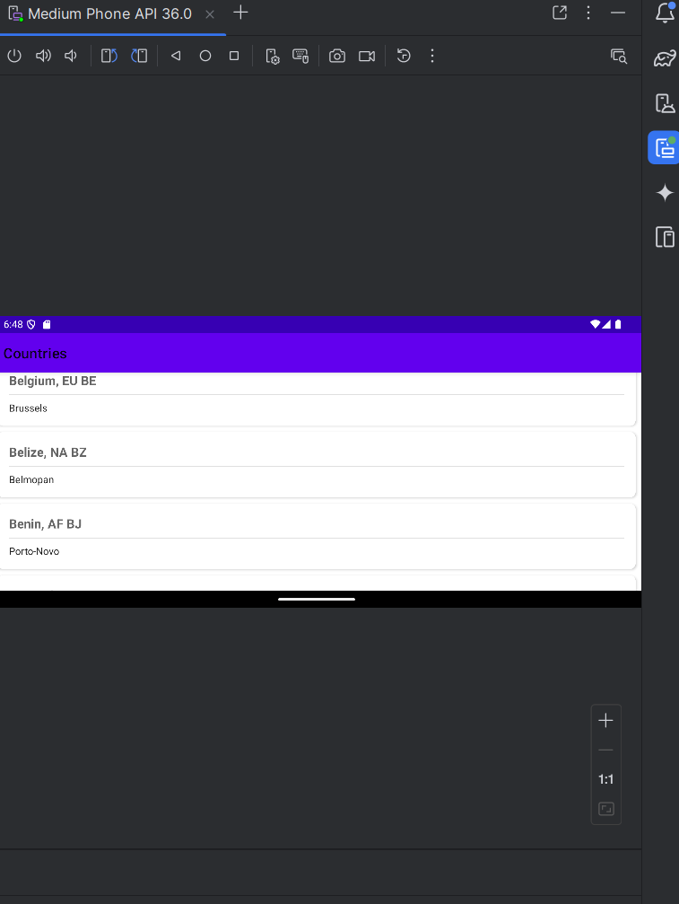

# Countries Android App

Android application that fetches and displays countries data from a JSON API.

## Features

- Fetches country data from remote JSON endpoint
- Displays countries in RecyclerView with scrolling
- Error handling for network failures
- Device rotation support
- Pull-to-refresh functionality
- Loading indicators

## Setup

1. Open project in Android Studio
2. Sync with Gradle files
3. Run on device/emulator (API 21+)

## Architecture

- MVVM pattern with ViewModel and LiveData
- Kotlin Coroutines for async operations
- OkHttp for network requests
- Gson for JSON parsing

## API

Data source: Used source given in Instructions doc.

## Screenshots

## Dependencies

- OkHttp
- Gson
- RecyclerView
- SwipeRefreshLayout
- ViewModel & LiveData
